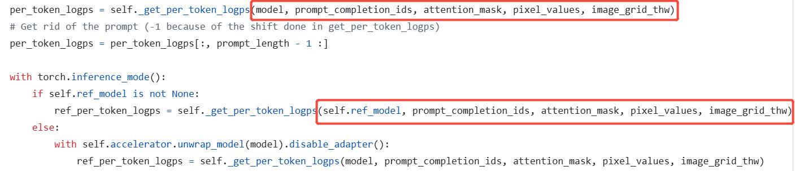

# R1-Video-fixbug
Recently, many awesome open-source projects have dedicated to applying Deepseek-R1/GPRO to multimodal tasks. Among them, [Open-R1-Video](https://github.com/Wang-Xiaodong1899/Open-R1-Video/) is one such awesome project applied to video understanding. During our reproduction, we found a bug in the code (**until 2025-02-22**). This bug caused the reference model to have problems **when executing the `get_per_token_probs` function, resulting in incorrect calculation of the KL divergence term**.
In addition, we found that not only Open-R1-Video has this problem, [open-r1-multimodal](https://github.com/EvolvingLMMs-Lab/open-r1-multimodal) also has this problem, which made us wonder whether this bug really exists, so we did some exploration.

## What is the bug?
In lines 444-453 of Open-R1-Video/src/open_r1_video/trainer/grpo_trainer.py, both the current model ($$\pi_{\theta}$$) and ref_model ($$\pi_{ref}$$) require passing through the `get_per_token_logps` function to execute a model forward and obtain logps. 

- In GRPO, $$\pi_{\theta}$$ and $$\pi_{ref}$$ differ only in their parameters, while their inputs should be identical

<div align='center'>

   
</div> 


- However, in the grpo_trainer implementations of both [Open-R1-Video](https://github.com/HarryHsing/Open-R1-Video/blob/main/src/open_r1_video/trainer/grpo_trainer.py) and [open-r1-multimodal](https://github.com/EvolvingLMMs-Lab/open-r1-multimodal/blob/main/src/open_r1/trainer/grpo_trainer.py), the inputs differ. Specifically, the model has the **"\*\*prompt_inputs"** argument, while ref_model lacks the **"\*\*prompt_inputs"** argument.

<div align='center'>

   
</div> 


- We further verified the implementation in [R1-V](https://github.com/Deep-Agent/R1-V/) and confirmed that the inputs to model and ref_model are indeed identical

<div align='center'>

   
</div> 


## What does the bug affect?
Intuitively, only for this part, Open-R1-Video and R1-multimodal are incorrect, while R1-V is the correct one. So, what are the impacts of this bug?
### 1. Issue with the input_embeds for Reference Model :
In the code, `**prompt_inputs` mainly contain two keys: `"pixel_values_videos"` and `"video_grid_thw."` These two variables represent the video input (in R1-multimodal, this is an image). When these variables are passed into get_per_token_logps, they enter the model.forward method of Qwen2VL (specifically, lines 1667-1703 of `transformers/src/transformers/models/qwen2_vl
/modeling_qwen2_vl.py/Qwen2VLForConditionalGeneration.forward`). If both pixel_values_videos and pixel_values are None, the input to Inputs_embedd will be the embedding of `<video_pad>`, rather than the embedding obtained from pixel_values through the vision_tower. **In this case, the reference model does not see any visual information, leading to an erroneous reference**.
### 2. Impact on KL Loss:
The KL loss is affected because the KL divergence calculation in grpo relies on the formula KL($$\pi_{\theta},\pi_{ref}$$). Since the logps output from the reference model ($$\pi_{ref}$$) is incorrect, the KL divergence becomes problematic. Specifically, during initialization, the parameters of the model and the reference model are identical, meaning that $$\pi_{\theta}$$ and $$\pi_{ref}$$ should have the same values. **Therefore, the correct initial value of KL divergence should be 0. However, in R1-Video, due to the incorrect logp from the reference model, the initial value of KL divergence is not 0**.

<div align='center'>

</div> 

   
## The fixed version
To resolve the issue, you should add **prompt_inputs in the get_per_token_logps method for the reference model. This will fix the bug as of February 22, 2025.
```python
per_token_logps = get_per_token_logps(model, prompt_completion_ids, **prompt_inputs)
# Get rid of the prompt (-1 because of the shift done in get_per_token_logps)
per_token_logps = per_token_logps[:, prompt_length - 1 :]

with torch.inference_mode():
   if self.ref_model is not None:
       ref_per_token_logps = get_per_token_logps(self.ref_model, prompt_completion_ids, **prompt_inputs) # fix_bug of r1-video
   else:
       with self.accelerator.unwrap_model(model).disable_adapter():
           ref_per_token_logps = get_per_token_logps(model, prompt_completion_ids, **prompt_inputs) # fix_bug of r1-video
```


